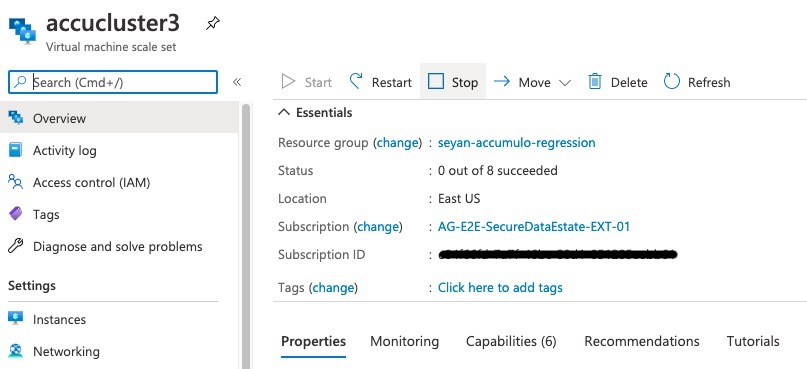
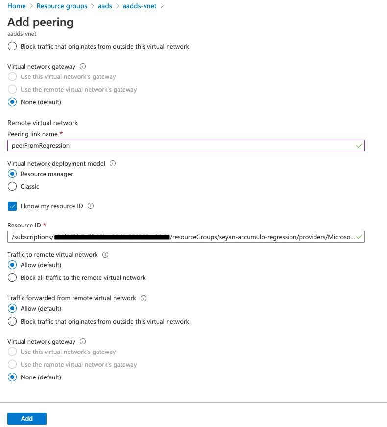
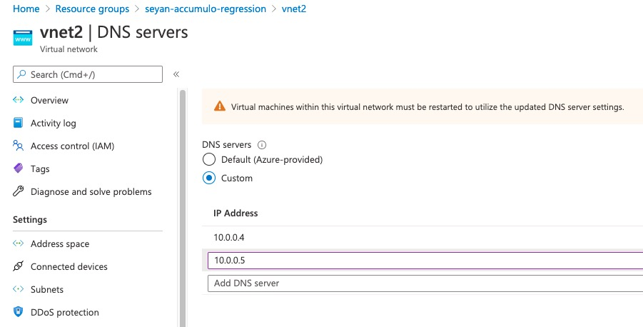
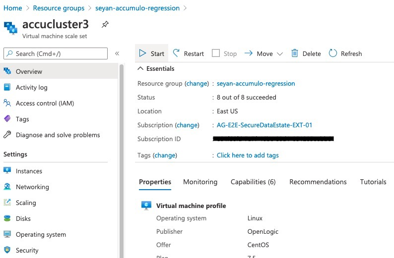

# Azure AD (AAD) Domain-joined & TLS enabled Accumulo cluster
This tutorial walks thru and captures the conversion steps from a plain accumulo with fluo-mucho to a AAD domain-joined & TLS enabled Accumulo cluster. We assume that you have already setup your own AAD and AAD domain services with secured ldap enabled. And, your flu-muchos has the internal patch (fluo-muchos includes the internal patch: https://dev.azure.com/AZGlobal/AG%20E2E%5E2%20-%20Secure%20Data%20Estate/_git/fluo-muchos/pullrequest/2874) to enable TLS. If you just want to enable TLS with no domain-join, please feel free to skip thoses steps for domain-joining (i.e. including VNET peering and ldap-related ansible-playbooks). 
Also, note that this tutorial does not include Kerberos-enabling for simplicity, but follow-up tutorial may turn the result into a Kerberos enabled cluster as well. 

## Launch & Set up an Accumulo cluster with fluo-mucho
Your muchos.properties should have proxy_hostname, azure_proxy_hostname. This proxy host would have ansible playbooks and the host file to be modified for conversion.

```
# change according to your python3 virtual environment path
source ~/p36env/bin/activate
./bin/muchos launch -c accucluster3
./bin/muchos setup -c accucluster3
``` 

## Stop cluster (i.e. Azure VMSS) thru Azure Portal
This steps is needed in order to take effect of VNET peering, and update DNS server of your Accumulo cluster VNET. From Azure portal, find your Accumulo cluster's VMSS and stop.




## VNET peering to AAD domain services VNET
Skip this step if you are not setting up a domain-joined cluster. Otherwise, go to your AAD domain service VNET, and create a bi-directional VNET peering. 


## Add DNS servers to your Accumulo cluster VNET
The DNS servers are from your AAD domain services. Find from its portal and add them to your Accumulo cluster vnet.



## Start cluster thru Azure Portal
Start the VMSS of your Accumulo cluster from Azure Portal.


## Edit ansible inventory file
Skip this step if you are not setting up a domain-joined cluster. Otherwise, SSH/log into your proxy or bastion host. The ansible inventory file is ~/ansible/conf/hosts, generated by fluo-mucho setup command. Add the following variables with your values (replacing XXX with yours) to the invetory file. Use lib/genEncodedPasswd.py (https://github.com/sjyang18/accumulo-w-aad/blob/main/lib/genEncodedPasswd.py) to geneate your own initial encoded password for generating users and the corresponding SPN. Original password and encoded one would be used to create users and retrieve keytab files for spn mapped to those users.

```
[all:vars]
domain_name=XXX.onmicrosoft.com
cluster_domain_name={{ domain_name }}
realm_name={{ domain_name |upper }}
domain_dn=DC=XXX,DC=onmicrosoft,DC=com
domain_workgroup=XXX
custom_ou_name=XXX
domain_admin_username=XXX
domain_admin_full_username='{{ domain_admin_username }}@{{ realm_name }}'
ldap_host_ip_address=ONE_OF_DNS_SERVER_ADDRESS_FROM_YOUR_DOMAIN_SERVER
ldap_hostname=ldaps.XXX.onmicrosoft.com
ldap_uri=ldaps://{{ ldap_hostname }}
ldap_binddn='CN={{ domain_admin_username }},OU=AADDC Users,{{ domain_dn }}'
encoded_user_init_password=:~~~~~~~~~~~~~
decoded_user_init_password=XXXXXX
```
## Git clone this repo to get domain utility playbooks 
Inside the proxy node, run to get this repo.

```
sudo yum install git
git clone https://github.com/sjyang18/accumulo-w-aad.git
```

## Domain-join your cluster with ansible-playbook commands
Skip these steps if you are not setting up a domain-joined cluster. 
The following ansible playbook executions would prompt the password of the domain_admin_username and make updates to Azure AD domain services using ldap.

```
ansible-playbook -i ~/ansible/conf/hosts accumulo-w-aad/ansible/ldap_config.yml

ansible-playbook -i ~/ansible/conf/hosts accumulo-w-aad/ansible/ldap_addou.yml

ansible-playbook -i ~/ansible/conf/hosts accumulo-w-aad/ansible/join_domain.yml

```

## Update ansible host and group variable files with FQDN
Skip this part if you are not setting up a domain-join cluster. Add the following variables to your ansible/conf/host file.

```
# this variable should be the same as domain_name vairlabe used before. 
cluster_domain_name = XXX.onmicrosoft.com
tls_password = $Update_Password
```

And, you also need to update zookeeper_connect varialbe in ansible/conf/host file. This variable is generated and set by lib/muchos/config/base.py. And, since we are running the conversion outside of fluo-muchos, this has to be manually updated. 
```
#zookeeper_connect = {{ host }}:2181,

zookeeper_connect = {{ host }}:2181{{ host }}.{{ cluster_domain_name }}:2181,
```
Also, update accumulo_zooker_connect variable in ansible/group_vars/all, too.
```
accumulo_zookeeper_connect: "{{ host }}:2181{{ host }}.{{ cluster_domain_name }}:2181,"
```


## Reconfigure Accumulo cluster with TLS
Then, run the enable-tls.yml ansible playbook with extra variables (like tls_password, etc). 

```
ansible-playbook ansible/enable-tls.yml -i ansible/conf/hosts -e "tls_password=$your_password_here"

# you may pass cluster_domain_name value if you are not have this in your host file
ansible-playbook ansible/enable-tls.yml -i ansible/conf/hosts -e "tls_password=$your_password_here cluster_domain_name=XXX.onmicrosoft.com"

```


## Verify certificates
SSH/Login into the first name node and verify that you have the host certifcate with FQDN. For example,

```
[azureuser@accucluster3-0 ~]$ keytool -list -keystore /opt/muchos/install/ssl/host-keystore.jks
Enter keystore password:
Keystore type: JKS
Keystore provider: SUN

Your keystore contains 2 entries

accucluster3-0, Feb 18, 2021, PrivateKeyEntry,
Certificate fingerprint (SHA-256): BC:E0:2B:02:0B:E0:8D:8B:AE:E5:2A:51:50:2A:DF:8D:42:78:E6:2A:73:78:CC:C0:FB:45:BC:F3:FA:A4:73:70
accucluster3-0.agceci.onmicrosoft.com-crt, Feb 18, 2021, trustedCertEntry,
Certificate fingerprint (SHA-256): BC:E0:2B:02:0B:E0:8D:8B:AE:E5:2A:51:50:2A:DF:8D:42:78:E6:2A:73:78:CC:C0:FB:45:BC:F3:FA:A4:73:70
```

If this is not case, verify if `'hostname -f'` will return FQDN host name and `/etc/hosts` file contains the FQDN for each host like:
```
172.19.0.5  accucluster3-0.XXX.onmicrosoft.com accucluster3-0
```

Also, verify that CA key is in truststore.jks like belows:
```
[azureuser@accucluster3-0 ~]$ keytool -list -keystore /opt/muchos/install/ssl/truststore.jks
Enter keystore password:
Keystore type: JKS
Keystore provider: SUN

Your keystore contains 1 entry

ca-key, Feb 18, 2021, trustedCertEntry,
Certificate fingerprint (SHA-256): 8B:E6:9B:34:BB:DF:24:C2:13:C8:64:D8:53:2B:40:79:12:3C:9C:CC:1C:46:AC:0B:AD:44:20:D3:08:92:E1:3C

```

## Zookeepers, Verification, and Debugging
In the following, I am capturing the each command I run to verify the TLS enabling and services running, rather than running a playbook. I recommend that you would do the same as verification process.
Log into each zookeeper node, start the zookeeper service, and verify the connectivity.

```
# on each zookeeper node you find in the inventory file
zkServer.sh start
```

Test zookeeper connectivity. For example,

```
zkCli.sh -server accucluster3-0.XXX.onmicrosoft.com:2181

Connecting to accucluster3-0.XXX.onmicrosoft.com:2181
Welcome to ZooKeeper!
JLine support is enabled
[zk: accucluster3-0.XXX.onmicrosoft.com:2181(CONNECTING) 0]
WATCHER::

WatchedEvent state:SyncConnected type:None path:null

[zk: accucluster3-0.XXX.onmicrosoft.com:2181(CONNECTED) 0] ls /
[accumulo, hadoop-ha, tracers, zookeeper]

```

If you see the error in connectivity to your zookeeper nodes, verfiy the zookeeper configurations. Verify that all host name references are using FQDN. 

```
# this must has server list like server.1, server.2, and server.3 with values.
less /opt/muchos/install/apache-zookeeper-3.5.9-bin/conf/zoo.cfg
# this should have server id like 1 ,2 , or 3
less /var/data/data2/zookeeper/myid
```

For debugging, you will see zookeeper log in 
```
ls -al /var/data/data2/logs/zookeeper/zookeeper-azureuser-server-*.log
```

## Hadoop, Verification, and Debugging
Start hadoop dfs services on one of name nodes, and verify if hadoop dfs services are up. Verify that all host name references in hadoop configurations are using FQDN. 

```
start-dfs.sh
jps -m
hdfs dfs -ls /accumulo
hdfs haadmin -getServiceState nn1
hdfs haadmin -getServiceState nn2
```

You should have at least one active name node. And, check if DFSZKFailoverController is in the output of `'jps -m'`. If not, it mean somethig to do with Zookeeper connectivities. Depending on whehter you enable TLS at zookeeper side, check the hadoop side configuration. For example, you shoud see the following environmental variables set in `/opt/muchos/install/hadoop-3.3.0/etc/hadoop/hadoop-env.sh`.

```
CLIENT_JVMFLAGS="-Dzookeeper.clientCnxnSocket=org.apache.zookeeper.ClientCnxnSocketNetty \
-Dzookeeper.client.secure=true \
-Dzookeeper.ssl.keyStore.location=/opt/muchos/install/ssl/host-keystore.jks \
-Dzookeeper.ssl.keyStore.password=XXXXXXXXX \
-Dzookeeper.ssl.trustStore.location=/opt/muchos/install/ssl/truststore.jks \
-Dzookeeper.ssl.trustStore.password=XXXXXXXXX"

export HDFS_ZKFC_OPTS="-server -XX:+UseG1GC -XX:MaxGCPauseMillis=400 -XX:InitiatingHeapOccupancyPercent=35 -XX:ParallelGCThreads=8 -XX:ConcGCThreads=2 -Xms4G -Xmx4G -verbose:gc -Xlog:gc:/var/data/data2/logs/hadoop/gc-zkfc.log-`date +'%Y%m%d%H%M'`:time,uptime:filecount=10,filesize=100M -XX:ErrorFile=/var/data/data2/logs/hadoop/hs_err_pid%p.log -XX:+HeapDumpOnOutOfMemoryError -XX:HeapDumpPath=/var/data/data2/logs/hadoop $CLIENT_JVMFLAGS"
```

Login into one of data node and verify that data node is up.
```
[azureuser@accucluster3-4 ~]$ jps -m
13121 Jps -m
22120 DataNode
```

Hadoop side logs are availalbe for debugging.
```
ls -al /var/data/data2/logs/hadoop/
```

## Accumulo, Verfication, and Debugging
Again, verify zookeer connect references are using FQDN in Accumulo configuration. On the first name node, start up your Accumulo cluster.
```
[azureuser@accucluster3-0 ~]$ accumulo-cluster start
Starting tablet servers ........ done
Starting master on accucluster3-0
OpenJDK 64-Bit Server VM warning: Option UseConcMarkSweepGC was deprecated in version 9.0 and will likely be removed in a future release.
SLF4J: Class path contains multiple SLF4J bindings.
SLF4J: Found binding in [jar:file:/opt/muchos/install/accumulo-2.1.0-SNAPSHOT/lib/log4j-slf4j-impl-2.14.0.jar!/org/slf4j/impl/StaticLoggerBinder.class]
SLF4J: Found binding in [jar:file:/opt/muchos/install/apache-zookeeper-3.5.9-bin/lib/slf4j-log4j12-1.7.25.jar!/org/slf4j/impl/StaticLoggerBinder.class]
SLF4J: See http://www.slf4j.org/codes.html#multiple_bindings for an explanation.
SLF4J: Actual binding is of type [org.apache.logging.slf4j.Log4jLoggerFactory]
Starting tserver on accucluster3-4
2021-02-03T00:13:39,226 [conf.SiteConfiguration] INFO : Found Accumulo configuration on classpath at /opt/muchos/install/accumulo-2.1.0-SNAPSHOT/conf/accumulo.properties
2021-02-03T00:13:41,607 [server.ServerUtil] INFO : Attempting to talk to zookeeper
2021-02-03T00:13:42,117 [server.ServerUtil] INFO : ZooKeeper connected and initialized, attempting to talk to HDFS
2021-02-03T00:13:42,137 [server.ServerUtil] INFO : Connected to HDFS
Starting tserver on accucluster3-6
Starting tserver on accucluster3-5
Starting tserver on accucluster3-8
Starting tserver on accucluster3-3
Starting gc on accucluster3-0
Starting tracer on accucluster3-0
Starting monitor on accucluster3-0
[azureuser@accucluster3-0 ~]$ Starting gc on accucluster3-1
Starting tracer on accucluster3-1
Starting master on accucluster3-1
OpenJDK 64-Bit Server VM warning: Option UseConcMarkSweepGC was deprecated in version 9.0 and will likely be removed in a future release.
SLF4J: Class path contains multiple SLF4J bindings.
SLF4J: Found binding in [jar:file:/opt/muchos/install/accumulo-2.1.0-SNAPSHOT/lib/log4j-slf4j-impl-2.14.0.jar!/org/slf4j/impl/StaticLoggerBinder.class]
SLF4J: Found binding in [jar:file:/opt/muchos/install/apache-zookeeper-3.5.9-bin/lib/slf4j-log4j12-1.7.25.jar!/org/slf4j/impl/StaticLoggerBinder.class]
SLF4J: See http://www.slf4j.org/codes.html#multiple_bindings for an explanation.
SLF4J: Actual binding is of type [org.apache.logging.slf4j.Log4jLoggerFactory]
2021-02-03T00:13:52,048 [conf.SiteConfiguration] INFO : Found Accumulo configuration on classpath at /opt/muchos/install/accumulo-2.1.0-SNAPSHOT/conf/accumulo.properties
2021-02-03T00:13:55,469 [server.ServerUtil] INFO : Attempting to talk to zookeeper
2021-02-03T00:13:56,104 [server.ServerUtil] INFO : ZooKeeper connected and initialized, attempting to talk to HDFS
2021-02-03T00:13:56,162 [server.ServerUtil] INFO : Connected to HDFS

```

Using ashell command, run basic tests.
```
[azureuser@accucluster3-0 ~]$ ashell
OpenJDK 64-Bit Server VM warning: Option UseConcMarkSweepGC was deprecated in version 9.0 and will likely be removed in a future release.
SLF4J: Class path contains multiple SLF4J bindings.
SLF4J: Found binding in [jar:file:/opt/muchos/install/accumulo-2.1.0-SNAPSHOT/lib/log4j-slf4j-impl-2.14.0.jar!/org/slf4j/impl/StaticLoggerBinder.class]
SLF4J: Found binding in [jar:file:/opt/muchos/install/apache-zookeeper-3.5.9-bin/lib/slf4j-log4j12-1.7.25.jar!/org/slf4j/impl/StaticLoggerBinder.class]
SLF4J: See http://www.slf4j.org/codes.html#multiple_bindings for an explanation.
SLF4J: Actual binding is of type [org.apache.logging.slf4j.Log4jLoggerFactory]
Loading configuration from /opt/muchos/install/accumulo-2.1.0-SNAPSHOT/conf/accumulo-client.properties
2021-02-03T00:14:38,187 [tracer.AsyncSpanReceiver] INFO : host from config: accucluster3-0
2021-02-03T00:14:38,188 [tracer.AsyncSpanReceiver] INFO : starting span receiver with hostname accucluster3-0

Shell - Apache Accumulo Interactive Shell
-
- version: 2.1.0-SNAPSHOT
- instance name: muchos
- instance id: 22d2e080-53d9-4160-998c-a6f829e11e20
-
- type 'help' for a list of available commands
-
root@muchos> createtable test4
root@muchos test4> insert a b c d
root@muchos test4> flush -w
2021-02-03T00:15:39,920 [shell.Shell] INFO : Flush of table test4  completed.
root@muchos test4> droptable test4
droptable { test4 } (yes|no)? yes
Table: [test4] has been deleted.
```

Like other service logs, Accumulo logs are :
```
ls -al /var/data/data2/logs/accumulo/
```


