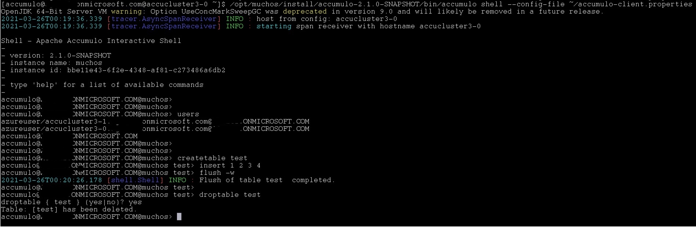

# Enabling Kerberos on domain-enabled and TLS-enabled Accumulo cluster
Given you have enabled Domain and TLS in your Accumulo cluster (for example, in our previous tutorial, I employed Azure AAD Domain service for this purpose, and the tutorial is available in https://github.com/sjyang18/accumulo-w-aad/blob/main/tutorials/domain_plus_tls/domain.plus.tls.md), this time, we are going to add & modify kerberos-related configuration to the cluster. In general, this involves the two stages: 1) adding service principals and their keytab files to your selected domain/kerberos service, 2) adding & modifying hadoop and accumulo configuration for enabling kerberos with keytab files. Currently, we have multiple domain services & kerberos service products and different methodologies to setting up e& gnerating keytab files. To avoid the tightly-coupled solution, this tutorial will show one replacable first stage of generating keytab files from the same cluster environment we created in the previous tutorial, and demonstrate the second stage deployment with the expected keytabs file name patterns.  

One caveat here is that I was only able to verify that following configuration to make kerberos work in Accumulo: **Disable TLS in zookeeper, Enable TLS & Kerberos in Haddoop, and Switch TLS to SASL (Kerberos) in Accumulo.**  I have captured the issue and report to accumulo github (https://github.com/apache/accumulo/issues/1984).

## Stop Accumulo services, HDFS, and zookeeper services
Before we proceed, make sure to stop services from one of head nodes. Follow this order of shutting service.

```
accumulo-cluster stop
stop-dfs.sh

# and reboot Azure VMSS from portal to stop zookeepers and other hadoop services 
```


## Git clone this repo to get fluo-mucho addon ansible playbooks 
Inside the proxy/bastion node, run to get this repo. We used this repo in the previous tutorial to join accumulo cluster to Azure AAD domain service.

```
sudo yum install git
git clone https://github.com/sjyang18/accumulo-w-aad.git
```
You may copy out ~/ansible/conf/hosts generated by fluo-much to $HOME and add the requried variables to hosts file (The variables is mentioned in https://github.com/sjyang18/accumulo-w-aad/blob/main/tutorials/domain_plus_tls/domain.plus.tls.md#edit-ansible-inventory-file). This will save from losing these variables when you run 'mucho sync' command. Some of variables you may check again depending on your cluster are:
```
cluster_domain_name=domain_name
ldap_hostname=XXX
ldap_host_ip_address=ONE_OF_DNS_SERVER_ADDRESS_FROM_YOUR_DOMAIN_SERVER
custom_ou_name=XXX              # custom organization unit where you want to add users
domain_admin_username=XXX       # one of username who is Azure AAD domain
```

## Service principal and keytab files
In order to enable kerberos in Accumulo cluster with fluo-mucho, we need to first generate service principals and keytab files for those. If you have followed our previous tutorial and joined your cluster to Azure AAD domain services, customers may run the following command to generate users, the corresponding service principals, and keytab files.

```
ansible-playbook -i hosts accumulo-w-aad/ansible/ldap_adduser.yml
```

Otherwise, we expect customers to generate those service principals and corresponding keytab files with the following file name convention.

```
HTTP.{{ hostname }}.keytab
{{ service_user_name }}.{{ hostname }}.keytab
```

For example, 'ldap_adduser.yml' would generate the following keytab files for my cluster and fetch them to keytabs directory in bastion host.
```
[azureuser@bastion ~]$ tree keytabs/
keytabs/
├── azureuser.accucluster3-0.keytab
├── azureuser.accucluster3-1.keytab
├── azureuser.accucluster3-2.keytab
├── azureuser.accucluster3-3.keytab
├── azureuser.accucluster3-4.keytab
├── azureuser.accucluster3-5.keytab
├── azureuser.accucluster3-6.keytab
├── azureuser.accucluster3-8.keytab
├── HTTP.accucluster3-0.keytab
├── HTTP.accucluster3-1.keytab
├── HTTP.accucluster3-2.keytab
├── HTTP.accucluster3-3.keytab
├── HTTP.accucluster3-4.keytab
├── HTTP.accucluster3-5.keytab
├── HTTP.accucluster3-6.keytab
└── HTTP.accucluster3-8.keytab
```

By chance, if you see the following error, you might have to update the password of AAD DC Administrator user 'https://myaccount.microsoft.com/'. Log into the site with the user you choose for AAD DC Administrator user and update its password.

```
ldap_sasl_bind(SIMPLE): Can't contact LDAP server (-1)
```

## Disable TLS from Zookeeper
Currently, Accumulo supports either SSL or SASL (for Kerberos), and thus we need to disable TLS in the zookeeper layer and remove zookeeper ssl client JVM switches from hadoop failover controller. The detailed issue can be captured and reported in (https://github.com/apache/accumulo/issues/1984).

To disable SSL from zookeeper, make the following configuration changes and replicate over other zookeeper nodes with scp.

```
# in /opt/muchos/install/apache-zookeeper-3.5.9-bin/conf/zoo.cfg.notls.2191
# change secureClientPort to clientPort
#secureClientPort=2191
cientPort=2191

# comment out or remove the ssl configurations
#serverCnxnFactory=org.apache.zookeeper.server.NettyServerCnxnFactory
#sslQuorum=true
#ssl.quorum.keyStore.location=/opt/muchos/install/ssl/host-keystore.jks
#ssl.quorum.keyStore.password=hadoop
#ssl.quorum.trustStore.location=/opt/muchos/install/ssl/truststore.jks
#ssl.quorum.trustStore.password=hadoop
#ssl.keyStore.location=/opt/muchos/install/ssl/host-keystore.jks
#ssl.keyStore.password=hadoop
#ssl.trustStore.location=/opt/muchos/install/ssl/truststore.jks
#ssl.trustStore.password=hadoop

```
Also need to remove CLIENT_JVMFLAGS and SERVER_JVMFLAGS from zookeeper-env.sh
```
# in /opt/muchos/install/apache-zookeeper-3.5.9-bin/conf/zookeeper-env.sh
# remove or comment out CLIENT_JVMFLAGS and SERVER_JVMFLAGS

#export CLIENT_JVMFLAGS="-Dzookeeper.clientCnxnSocket=org.apache.zookeeper.ClientCnxnSocketNetty \
#    -Dzookeeper.client.secure=true \
#    -Dzookeeper.ssl.keyStore.location=/opt/muchos/install/ssl/host-keystore.jks \
#    -Dzookeeper.ssl.keyStore.password=hadoop \
#    -Dzookeeper.ssl.trustStore.location=/opt/muchos/install/ssl/truststore.jks \
#    -Dzookeeper.ssl.trustStore.password=hadoop"

#export SERVER_JVMFLAGS="-Dzookeeper.serverCnxnFactory=org.apache.zookeeper.server.NettyServerCnxnFactory \
#    -Dzookeeper.ssl.keyStore.location=/opt/muchos/install/ssl/host-keystore.jks \
#    -Dzookeeper.ssl.keyStore.password=hadoop \
#    -Dzookeeper.ssl.trustStore.location=/opt/muchos/install/ssl/truststore.jks \
#    -Dzookeeper.ssl.trustStore.password=hadoop"
```
In my cluster, I used the following scp commands to replicate configurations.
```
cd /opt/muchos/install/apache-zookeeper-3.5.9-bin/conf
scp zoo.cfg accucluster3-1:$(pwd)/
scp zoo.cfg accucluster3-2:$(pwd)/
scp zookeeper-env.sh accucluster3-2:$(pwd)/
scp zookeeper-env.sh accucluster3-2:$(pwd)/
```

In addition, since we disable TLS in zookeeper, we also need to disable zookeeper ssl clients jvm switches in HDFS_ZKFC.
```
# in /opt/muchos/install/hadoop-3.3.0/etc/hadoop/hadoop-env.sh,
# comment out or remove CLIENT_JVMFLAGS with zookeeper.ssl.* jvm flags
#CLIENT_JVMFLAGS="-Dzookeeper.clientCnxnSocket=org.apache.zookeeper.ClientCnxnSocketNetty \
#-Dzookeeper.client.secure=true \
#-Dzookeeper.ssl.keyStore.location=/opt/muchos/install/ssl/host-keystore.jks \
#-Dzookeeper.ssl.keyStore.password=hadoop \
#-Dzookeeper.ssl.trustStore.location=/opt/muchos/install/ssl/truststore.jks \
#-Dzookeeper.ssl.trustStore.password=hadoop"

# make sure HDFS_ZKFC_OPTS not to include $CLIENT_JVMFLAGS
export HDFS_ZKFC_OPTS="-server -XX:+UseG1GC -XX:MaxGCPauseMillis=400 -XX:InitiatingHeapOccupancyPercent=35 -XX:ParallelGCThreads=8 -XX:ConcGCThreads=2 -Xms4G -Xmx4G -verbose:gc -Xlog:gc:/var/data/data2/logs/hadoop/gc-zkfc.log-`date +'%Y%m%d%H%M'`:time,uptime:filecount=10,filesize=100M -XX:ErrorFile=/var/data/data2/logs/hadoop/hs_err_pid%p.log -XX:+HeapDumpOnOutOfMemoryError -XX:HeapDumpPath=/var/data/data2/logs/hadoop"

```
Note that we are still keeping TLS configurations in hadoop side with ssl-client.xml and ssl-server.xml, and other https protocol configurations in core-site.xml, hdfs-site.xml, mapred-site.xml, and yarn-site.xml. We just turn off TLS client to zookeeper in HDFS_ZKFC, since zookeeper is no longer running with server-side TLS configuration.

## Add Kerberos configuration in Hadoop and Accumulo
Deploy kerberos configuration to Hadoop and Accumulo with the following command.

```
ansible-playbook -i ~/hosts accumulo-w-aad/ansible/enable-kerberos.yml
```

If needed, you may override variable 'service_principal_login' and 'keytabs_pickup_dir' with -e switch. The default values for these variables are current user login in bastion host, and its ~/keytabs directory respectively.


## Administratove User
As mentioned in Accumulo user document (https://accumulo.apache.org/docs/2.x/security/kerberos#administrative-user), the Accumulo still has a single user 'root' with administrative permission. This has to change to authenticate with kerberos with 'accumulo init --reset-security' command. **Make sure that you stop accumulo services before resetting the administrative user.** Let's say you have accumulo_admin@EXAMPLE.COM as your admin. Before resetting admin, login in with your service principal user name (i.e. azureuser in my case) to Accumulo master/manager nodes, run kinit with your service principal and its keytab file. For example in my cluster,

```
kinit -r9d -kt /opt/muchos/install/keytabs/azureuser.keytab azureuser/accucluster3-1.example.com@EXAMPLE.COM
```

If you have multiple master/manager nodes, run kinit on other master/manager nodes too. Even though you have configured this service principal and its keytab file in accumulo.properties, my observation is that 'Accumulo init' process is picking up the kerberos authentication from the current login's key cache, and this key cache should be set on all master/manager during 'Accumulo init' process. Otherwise, you will see the 'Authentication' related error. 

Then, run 'accumulo init --reset-security' and give your admin user account and its password during the process.
```
$ accumulo init --reset-security
Running against secured HDFS
Principal (user) to grant administrative privileges to : acculumo_admin@EXAMPLE.COM
Enter initial password for accumulo_admin@EXAMPLE.COM (this may not be applicable for your security setup):
Confirm initial password for accumulo_admin@EXAMPLE.COM:
```

If it is ok to lose existing datta in accumulo, you could completely drop accumulo directory from HDFS and rerun 'accumulo init' without '--reset-security', which I did during troubleshooting.

```
hdfs dfs -rm -r /accumulo
accumulo init
```

## Start up services one by one
Start zookeepers, hadoop dfs services, and Accumulo. For example, in my cluster environment, I run the following commands on a head node.

```
# start zookeepers
zkServer.sh start
ssh accucluster3-1 "/opt/muchos/install/apache-zookeeper-3.5.9-bin/bin/zkServer.sh start"
ssh accucluster3-2 "/opt/muchos/install/apache-zookeeper-3.5.9-bin/bin/zkServer.sh start"

# start hadoop dfs services
start-dfs.sh

# start accumulo services
accumulo-cluster start

```

## Kerberos Verfication in Accumulo
Change your login to your admin. In my testing environment, 'accumulo' is the admin user name. We are verifying the admin user may create a table, insert data, flush data, and drop the table.

```
sudo su accumulo
```

Copy accumulo-client.properties into its home diretory and update auth.principal.
```
cd ~
cp /opt/muchos/install/accumulo-2.1.0-SNAPSHOT/conf/accumulo-client.properties ~/

## vi accumulo-client.properties
auth.principal=accumulo@EXAMPLE.ONMICROSOFT.COM
```

Run 'kinit' 
```
kdestroy
kinit -V accumulo@EXAMPLE.ONMICROSOFT.COM
# give passowrd to login and get kerberos key
```
Start accumulo shell with the new accumulo-client.properties. Note that 'ashell' command will start with the default accumulo-client.properties file, which is not what we want. 


```
 /opt/muchos/install/accumulo-2.1.0-SNAPSHOT/bin/accumulo shell --config-file ~/accumulo-client.properties
```
You should see the login prompt is your 
Run the basic operations to verify kerberos-based authentication and permission. Below, I captured the screenshot and blacked out the full domain name for security reason.  



Do the same testing with another normal user account in Azure AD. You should see the permission error. Fix the permission error with the following from accumulo admin shell.

```
# before retesting, grant
grant System.CREATE_TABLE -s -u seyan@EXAMPLE.ONMICROSOFT.COM

# after testing, revoke 
#revoke System.CREATE_TABLE -s -u seyan@EXAMPLE.ONMICROSOFT.COM
```

And, this time, the normal user should be able to run basic operational tests without permission errors.


